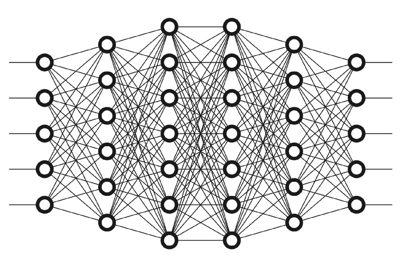
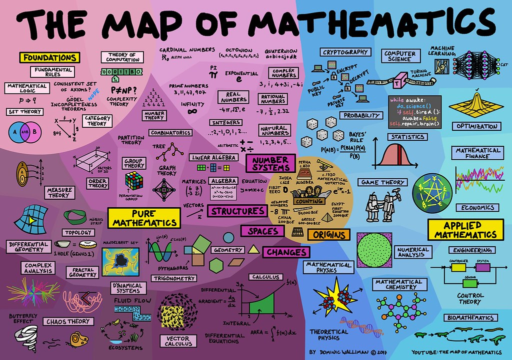
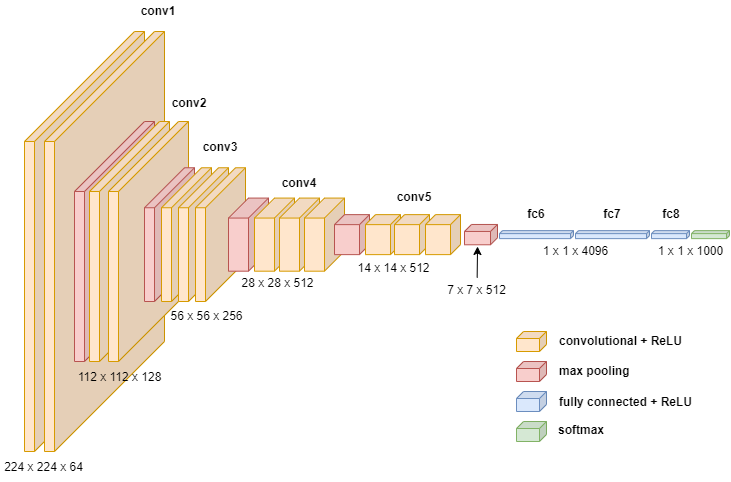

# Deep Learning Road Map

## ***A link to this article on Medium: [A Deep Learning Road Map And Where To Start](https://medium.com/@ArianAmani/the-deep-learning-road-map-that-i-took-c29120b0f5e2)***

## Before getting started:
Before getting started, I have to say that this is the path I took/would have taken, and it worked for me pretty well. But it sure doesn’t mean that it’ll work for everyone.

So if you don't feel like this is the path for you, there are hundreds of different road maps on the web.

There are two main points of view on learning ML and DL:
1. Start with the code, you'll have time to learn theoretical stuff and the math behind it later.
2. **Start with theoretics and the math behind them, then write the code.**

Well, I’m a huge fan of the **second opinion** and I really don’t like the first one. But don’t get scared away, all good paths and courses come with a **balanced combination of Theoretics and Code**, and I tend to introduce them.

The reason I prefer the second path is that **if you just learn to write code and don’t know what exactly is happening behind that code, you can’t actually solve problems on your own.** Say you get a task with a few problems to solve, and you need to choose a Machine Learning algorithm to tackle these problems. All these problems are numerical and therefore need mathematical computation and solutions. You’ll face new problems that you haven’t seen before and without knowing the math and the logic behind these algorithms, you can’t choose the right solution to your problem (and of course, you can’t try them all to find which one works best).

So knowing these, let’s start talking about the path itself.\
*In most of the parts, I'll introduce different sources based on how deep you want to get or how much time you've got.*

**I recommend reading through to the end before getting started on any of the courses.**

## Mathematics
As a Computer Science student myself, I was familiar with most of the math I needed to start, but if you're starting with not much background in mathematics, this is where I'd suggest you start (If you're familiar with these, feel free to skip):

- ### Linear Algebra:
	- Fast and efficient way: 
		[Coursera Mathematics for Machine Learning: Linear Algebra](https://www.coursera.org/learn/linear-algebra-machine-learning?specialization=mathematics-machine-learning)  
	- There's also this legendary course on Linear Algebra, taught by Prof. Gilbert Strang at MIT, and it's publicly accessible. Well, I'd really recommend watching this course if you're really into math and want to learn a whole lot more about linear algebra, and you've got the time too. It's definitely more than enough for starting ML, but if you feel like learning more, go for it:
		[MIT OCW Linear Algebra 18.06](https://ocw.mit.edu/courses/18-06-linear-algebra-spring-2010/)
		[YouTube Playlist](https://www.youtube.com/playlist?list=PL221E2BBF13BECF6C)
	
- ### Calculus:
	-   Fast and efficient way: 
		[Coursera Mathematics for Machine Learning: Multivariate Calculus](https://www.coursera.org/learn/multivariate-calculus-machine-learning?specialization=mathematics-machine-learning)

- ### Probability and Statistics:
	- Fast and efficient way:\
		You can probably learn everything you need at Khan Academy:\
		[https://www.khanacademy.org/math/statistics-probability](https://www.khanacademy.org/math/statistics-probability)
		
	- More deep and academic way:\
		If you would like to dive deeper into the world of probability and statistics, I'd suggest the book "**Probability and Statistics for Engineers and Scientists" by Walpole, Mayers, Ye.**

**These cover the math you need for ML and DL and you won’t need to worry about that part anymore.**

**There’s also this book called [“Mathematics for Machine Learning”](https://mml-book.github.io/) and it’s free online, I’d suggest reading this instead of all the above if you’re a book person and want something well structured all in one place. But if you think you may let it go in the middle of the book, just stick to the courses above.**

Let’s go to the next part.

## Python
You’re going to need some programming skills(preferably in python) before getting started. Well there are hundreds of Python tutorials on the web, so I’m just going to list two of them for your ease, if you don’t like either, just search “learn python” and you’ll find everything you need.
- [SoloLearn Python 3 Tutorial](https://www.sololearn.com/Course/Python/) (Free)
- [Udemy Complete Python Developer in 2022: Zero to Mastery](https://www.udemy.com/course/complete-python-developer-zero-to-mastery/)(Paid)

## Machine Learning

Now we're getting to the fun parts.

Again here, I'm going to recommend two courses, one easier to follow, and one more deep and academic.

- **Easier to follow (Probably more popular):**
	- [Machine Learning Specialization by Andrew Ng](https://www.coursera.org/specializations/machine-learning-introduction)\
		This is probably the most popular ML course on the internet and A LOT of people have started their path into ML using it. It's also the most popular and I guess the highest ranked course on Coursera (4.9/5).

		This Specialization is made of 3 courses covering the main parts of Machine Learning and by the end of it, you'll have a good understanding of ML Algorithms and how to implement and use them in python.
		
		You can audit the course for free, or enroll to get the certificate. Also, Coursera has this option called Financial Aid for those who can't afford the course, you can just click on the Financial Aid button and explain why you should get this course for free and in 15 days, you'll receive an email saying Congrats, you got it :)))

- **More deep, academic course:**
	- Stanford CS229 Machine Learning\
		This is the Machine Learning course taught at Stanford University, recorded in the class and uploaded on YouTube.

		Well, as I said before, I'm a fan of more deep academic courses and this is **THE COURSE** to go with if you're like me.
		It involves a lot more math and details on ML concepts and algorithms and of course is more difficult to follow, but if you think you'll be ok with the huge math and stuff and you won't run away halfway through the course, don't even hesitate to start with this one.

		The videos are uploaded online on YouTube and the course material is accessible from the course website.
		Two versions are available online, one from the [**Autumn 2018 (Andrew Ng)**](https://www.youtube.com/playlist?list=PLoROMvodv4rMiGQp3WXShtMGgzqpfVfbU) semester and one from [**Summer 2019 (Anand Avati)**](https://www.youtube.com/playlist?list=PLoROMvodv4rNH7qL6-efu_q2_bPuy0adh).
		
		The first one is taught by Andrew Ng, the same instructor as the Coursera ML course introduced above, and the latter one is taught by Anand Avati, Andrew's Ph.D. student.

		Choosing between the two is more a personal preference, I myself love Andrew's way of teaching and I'm more comfortable with it.\
		Although, Anand Avati's course is newer and covers more subjects. It even involves the math required for the course in the first three lectures.

		**I'd suggest you watch one lecture from each, and choose the one you're more comfortable with, and stick with it.**

## Deep Learning
Ah, finally the great field of Neural Networks.

Deep Learning is a part of ML and as today, it's the most famous and the most useful part.
It isn't a new method actually, it was introduced in 1943 by Warren McCulloch and Walter Pitts. But back then, we didn't have the computational resources to carry out the calculations in a Neural Network Model. So it wasn't used much.

With the growth of computers and more powerful GPUs, Neural Networks began to lead the AI world.

Now I'm again, going to recommend two courses, one easier to follow, and one more deep and academic.

- **Easier to follow (Probably more popular):**
	- [Deep Learning Specialization offered by DeepLearning.AI taught by Andrew Ng](https://www.coursera.org/specializations/deep-learning)\
		This is a 5-course specialization, covering almost everything you need to understand Deep Learning and its ways.

		As the ML Coursera course, you can audit for free or ask for a financial aid here too.
		I definitely recommend watching this to get started on Deep Learning if you like Coursera-like courses.

- **More deep, academic course:**
	- [Stanford CS231n: Deep Learning for Computer Vision](https://www.youtube.com/playlist?list=PL3FW7Lu3i5JvHM8ljYj-zLfQRF3EO8sYv)\
		I actually started Deep Learning with this course, and I've got to say, it's THE BEST COURSE to start with if you're ok to get a little deeper into the field like me.

		It is more focused on Deep Learning applications in Computer Vision, but it also covers ALL the basic and necessary aspects of Deep Learning too. So you should not worry about it being for Computer Vision at all.
		
		As a matter of fact, I watched the whole DL Specialization mentioned above too, after finishing this course, and I already knew all the stuff taught in the Specialization (and more) from this course. It even involves some Neural Network architectures mostly used in NLP.

		The only part of the Coursera Specialization that teaches more than this is the 5th course (Sequence Models) which is more focused on NLP.

		Its only drawback is that the available lecture videos are from the 2017 class, and it doesn't cover some new topics like transformers. But if you're interested enough, you'll learn that new stuff on your own. (There's also CS231n's new semester's course notes available which you can keep reading from those to learn the new methods too)

	After CS231n, I'd recommend [CS224n](https://www.youtube.com/playlist?list=PLoROMvodv4rOSH4v6133s9LFPRHjEmbmJ) if you're interested in Natural Language Processing and want to get deep in that field.

**Choosing between Andrew Ng's Specialization vs. CS231n is based on your own personal preference. As for me, I prefer CS231n WAY MORE.**

## Reading Resources
Reading is always a key to getting deeper. If you're into that, there are some books I like personally that can help you with the process:
- [**The legendary Deep Learning book**](https://www.deeplearningbook.org/)\
	This book is like a legend between Deep Learning books. It covers the concepts and the math behind DL algorithms perfectly. I don't recommend starting with this book since it's really hard. But if you want to strengthen your knowledge after completing the courses above, this book is prefect.

- **Hands-on machine learning with Scikit-learn Keras and TensorFlow by Aurelion Geron published by O'Reilley**\
	This book is an awesome resource for learning ML and DL and also learning to code and implement the algorithms. I'd recommend starting with this if you're more comfortable with books than courses.

- [**Dive into Deep Learning**](https://d2l.ai/)\
	This is an awesome reference for both getting into the math and the code for Deep Learning. It contains code examples and implementations in all popular DL frameworks (PyTorch, Tensorflow, and MXNET)\
	It's available online for free and constantly updated and involves all the newest material on Deep Learning.\
	If you've got the time, I definitely suggest reading this. I'm actually starting to read it for upgrading my coding knowledge.

## Extras and where to go
By this stage you probably know what you're doing, and you'll be able to find the path to go from here.
Something stuff would recommend:
- Read Papers: This will give you deeper knowledge of algorithms and the things happening behind the code. I'd offer following these awesome lists for starters since there are numerous papers out there:
	- https://ml.berkeley.edu/reading-list/
	- https://github.com/floodsung/Deep-Learning-Papers-Reading-Roadmap
- Something that will definitely help you upgrade your coding skills is doing projects for yourself. Just search for ML or DL project ideas and start coding, you could upload them on your GitHub too to enrich your GitHub.
- Starting with some challenges on [Kaggle](https://www.kaggle.com/) will give you an awesome head start in coding experience. There are a huge lot of competitions and datasets which you can use to improve your coding skills.
- [DataCamp](https://www.datacamp.com/) offers some excellent tutorials for improving your coding skills in working with datasets. I'd really suggest you check some of its courses out, specially for learning to work with tabular data and handling them. (It's not free but if you're a student with a verifiable school-issued email, you can subscribe to GitHub Student Developer Pack and get a free 2-month Data Camp account - something I did)

---
**I'll try to keep this Road Map updated, and I really hope it was useful to you.**\
**Thank you for reading through.**

### About me
I'm Arian, a Computer Science student interested in Deep Learning research, and it's applications in real life problems.

I'd be happy to answer any questions if I'm able to. Feel free to contact me on Twitter or LinkedIn.

**Twitter: [twitter.com/ArianAmaani](https://twitter.com/ArianAmaani)** \
**GitHub: [github.com/ArianAmani](https://github.com/ArianAmani/)** \
**LinkedIn: [linkedin.com/in/arianamani](https://www.linkedin.com/in/arianamani/)**
